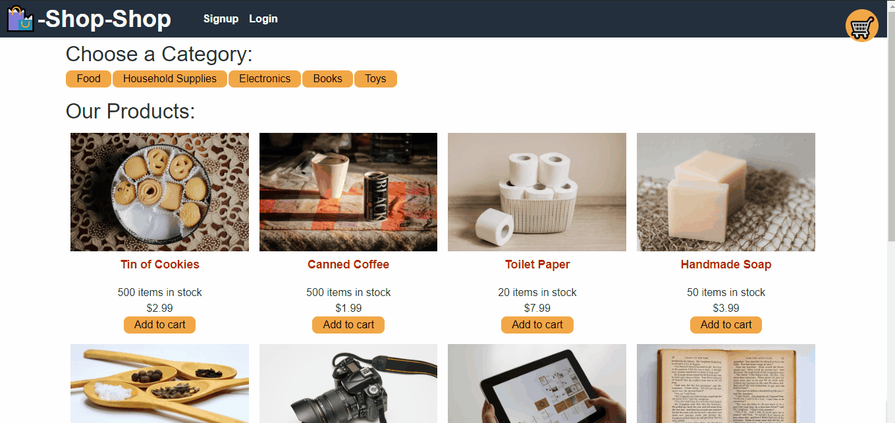

<div id="top"></div>

<!-- Badges -->
[](http://shields.io/)
[](http://shields.io/)
[](http://shields.io/)
[](http://shields.io/)
[](http://shields.io/)
[](http://shields.io/)
[](http://shields.io/)
[](http://shields.io/)
[](http://shields.io/)

[](http://shields.io/)

# Redux-Store
The Context API is quickly gaining traction as a worthy alternative or perhaps even successor to other libraries that manage global state in tandem with React, such as Flux or MobX. Nonetheless, the open source JavaScript library Redux remains the industry standard for managing complex state in a large-scale React application, and you’ll likely encounter it on the job.

## Table of Contents
<!-- TABLE OF CONTENTS -->
<details>
  <summary><strong>Table of Contents</strong></summary>
  <ol>
    <li>
      <a href="#about-the-project">About The Project</a>
      <ul>
        <li><a href="#built-with">Built With</a></li>
      </ul>
    </li>
    <li><a href="#user-story">User Story</a></li>
    <li><a href="#link-to-live-demo">Link to Live Demo</a></li>
    <li><a href="#usage">Usage</a></li>
    <li><a href="#prerequisites">Prerequisites</a></li>
    <li><a href="#installation">Installation</a></li>
    <li><a href="#contributing">Contributing</a></li>
    <li><a href="#license">License</a></li>
    <li><a href="#contact">Contact</a></li>
    <li><a href="#acknowledgments">Acknowledgments</a></li>
  </ol>
</details>

## About The Project 


<p align="center">
   
&nbsp; &nbsp; &nbsp; &nbsp;
  
&nbsp; &nbsp; &nbsp; &nbsp;
  

</p>

## User Story

```md
AS a senior engineer working on an e-commerce platform
I WANT my platform to use Redux to manage global state instead of the Context API
SO THAT my website's state management is taken out of the React ecosystem
```
### Link to Live Demo
[Redux]()

### Prerequisites

Please make sure that you have the latest node packages.
* npm
  ```sh
  npm install npm@latest -g
  ```

## Installation
For instructions to add Redux to your application, refer to the [Redux Fundamentals basic tutorial](https://redux.js.org/basics/basic-tutorial). Note that the documentation will refer to additional packages that you'll need to complete this implementation.

**Important**: Be sure to review ALL of the documentation, because there are newer methods that can make these tools much easier to implement. React has gone through several iterations; as such, some React-and-Redux tutorials will assume that you aren't using Hooks.
- If you want to run the app on your local server download it through Github.
- Run npm i or (npm install), to make sure to download all the necessary files in the jason package.
- In your command shell run npm start.

## Usage 
The fact that most modern websites are driven by two things: data and user demands. This shouldn't come as a surprise, as the ability to personalize user data is the cornerstone of real-world web development today. And as user demands evolve, applications need to be more performant.

<p align="center">
   
&nbsp; &nbsp; &nbsp; &nbsp;
  
&nbsp; &nbsp; &nbsp; &nbsp;
  
</p>

* Demo-1: A user registers on the Signup page and then navigates to the Products page, which displays images and descriptions of products.
* Demo-2: The user selects a category, chooses a product, views details about it on the product page, and adds it to and removes it from their shopping cart.
* Demo-3: The user checks out by going to their shopping cart.

### Built With

* React, Node.js, Bootstrap liberary, Apollo server, GraphQL and Mongodb.
* Deployed through Heroku.
<p align="right">(<a href="#top">back to top</a>)</p>

## Contributing

Contributions are what make the open source community such an amazing place to learn, inspire, and create. Any contributions you make are **greatly appreciated**.

If you have a suggestion that would make this better, please fork the repo and create a pull request. You can also simply open an issue with the tag "enhancement".
Don't forget to give the project a star! Thanks again!

1. Fork the Project
2. Create your Feature Branch (`git checkout -b feature/AmazingFeature`)
3. Commit your Changes (`git commit -m 'Add some AmazingFeature'`)
4. Push to the Branch (`git push origin feature/AmazingFeature`)
5. Open a Pull Request


<!-- CONTACT -->
## Contact
[](http://shields.io/)

Mohamed Mesahel - mohamed.mesahel86@gmail.com

[](http://shields.io/)

https://github.com/MohamedMesahel

[![LinkedIn][linkedin-shield]][linkedin-url] 

<!-- LICENSE -->
## License

Distributed under the MIT License. 
<!-- ACKNOWLEDGMENTS -->
## Acknowledgments

List for some useful resources!
* [Redux Fundamentals basic tutorial](https://redux.js.org/basics/basic-tutorial)
* [MongoDB documentation on Deploy with Heroku](https://www.mongodb.com/developer/how-to/use-atlas-on-heroku/)
* [Apollo Server Documentation](https://www.apollographql.com/docs/)
* [GraphQL](https://graphql.org/code/)


<p align="right">(<a href="#top">back to top</a>)</p>

<!-- MARKDOWN LINKS & IMAGES -->
<!-- https://www.markdownguide.org/basic-syntax/#reference-style-links -->
[linkedin-shield]: https://img.shields.io/badge/LinkedIn-0077B5?style=for-the-badge&logo=linkedin&logoColor=white
[linkedin-url]: https://www.linkedin.com/in/mohamed-mesahel-pmp-570a0423/

